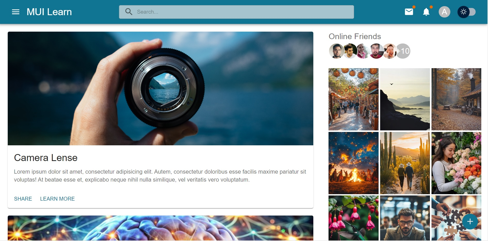

# Web Mini Project with React and Material-UI v6

This project is a simple web page designed using the React framework and Material-UI library. It showcases various features of Material-UI and is responsive in design.

## Project Preview

  
*Figure: A preview of the application showcasing its layout and features.*

## Features

- **Single Page Layout:** Dynamic updates with material design elements
- **Theme Switching:** Ability to switch between different themes for enhanced user experience
- **React Context API:** State management using React's Context API for better scalability and component communication
- **Responsive Design:** Built to display well across different screen sizes
- **Cards:** Utilizes cards to showcase content and posts
- **Post Creator:** Easily create new posts

## Repository Introduction

This repository, located at [https://github.com/amin93k/React-MUI-Mini-Project.git](https://github.com/amin93k/React-MUI-Mini-Project.git), serves as a demonstration of using React and Material-UI together to create a visually appealing and functional web application. Feel free to explore the code and contribute!  